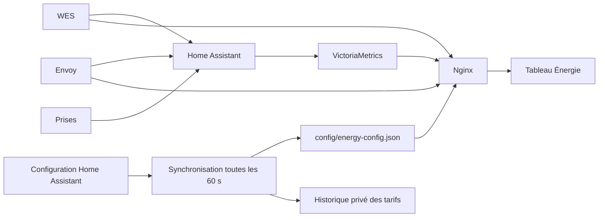

# Architecture

## Déploiement actuel

Sur le NAS Synology :

| Élément | Emplacement |
| --- | --- |
| Page servie | `/volume1/docker/energie/html/index.html` |
| Serveur web | conteneur `energie-dashboard` |
| Configuration Nginx privée | `/volume1/docker/energie/nginx.conf` |
| Home Assistant | `/volume1/docker/homeassistant/config` |
| Synchronisation | conteneur `energie-config-sync` |
| Script et état du synchroniseur | `/volume1/docker/energie/config-sync` |
| Configuration publiée | `/volume1/docker/energie/html/config/energy-config.json` |
| Sauvegardes du site | `/volume1/docker/energie/backups` |

Le site et son synchroniseur ne dépendent pas du serveur Téléinfo/MariaDB de Montsegur. Cela ne signifie pas que cette VM peut être arrêtée : ses autres services et l’exhaustivité des anciens historiques doivent être traités séparément.

## Contrat des points d’accès web

Le navigateur utilise uniquement des chemins de même origine :

| Chemin | Usage |
| --- | --- |
| `/wes/data.cgx` | compteurs instantanés WES |
| `/envoy/api/v1/production` | production solaire instantanée |
| `/envoy/ivp/meters/readings` | puissance réseau active |
| `/vm/api/v1/query` | dernière valeur et fin de période |
| `/vm/api/v1/query_range` | historiques |
| `/config/energy-config.json` | appareils, sources, tarifs et dates d’observation |

Nginx conserve les authentifications des équipements côté serveur. Seuls les points d’accès nécessaires doivent être publiés, en lecture seule ; ne pas exposer les interfaces administratives ou tout le répertoire Home Assistant. Le fichier Nginx de production est volontairement absent du dépôt car il contient des secrets.

## Synchronisation

Le service lit les fichiers `.storage/energy`, `core.entity_registry`, `core.device_registry` et `core.area_registry` en lecture seule. Il ne modifie pas Home Assistant.

Il publie uniquement les identifiants de capteurs, noms, pièces, catégories de sources et tarifs nécessaires. Les fichiers de registre complets ne sont jamais copiés dans le répertoire web. Le JSON est remplacé atomiquement ; une erreur de lecture conserve la dernière version valide. Une version calculée sur le contenu évite les rechargements inutiles.

Les tarifs fixes sont pris dans `number_energy_price` / `number_energy_price_export`. Un tarif basé sur un capteur est lu dans VictoriaMetrics s’il est exporté en `EUR/kWh` ou `€/kWh`. Un tarif absent reste inconnu, jamais égal à zéro par défaut. Les capteurs de coût déjà cumulés et les corrections forfaitaires ne sont pas convertis en tarifs.

Le navigateur vérifie la configuration toutes les minutes. Le délai visible d’un changement peut atteindre environ deux minutes. Un avertissement apparaît si la configuration a plus de trois minutes ou devient inaccessible. La dernière configuration en mémoire est conservée ; au démarrage, les sources de secours versionnées peuvent être utilisées si le JSON est inaccessible.

Les sources électriques dynamiques reconnues sont les capteurs `sensor.*` configurés comme réseau ou solaire dans le format actuellement utilisé par Home Assistant. Les imports supplémentaires sont regroupés visuellement avec les autres achats hors du compteur HC connu ; chaque source conserve son propre tarif. Le panneau instantané principal reste lié aux équipements WES et Envoy de cette maison. Eau et gaz restent configurés dans le code.
